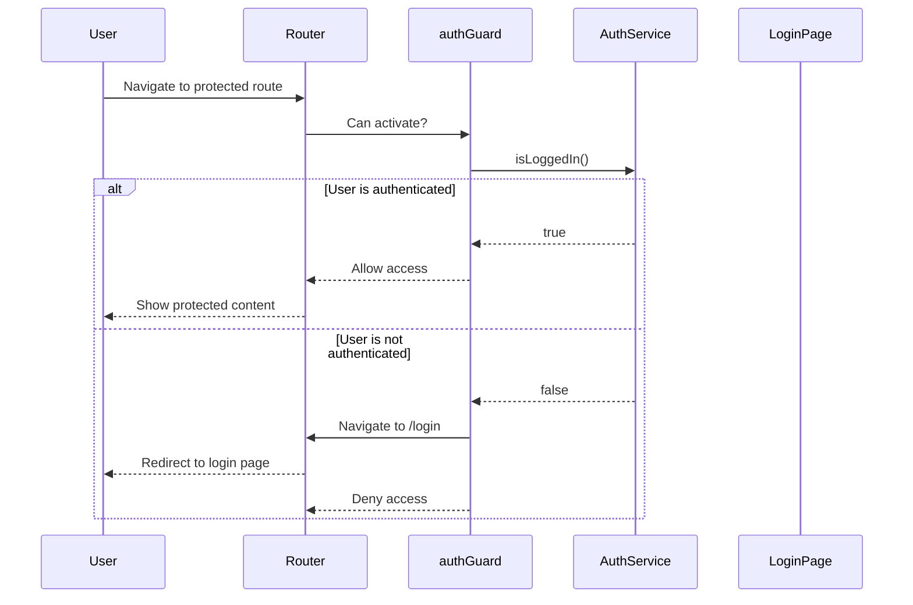

## Overview

The `authGuard` is a functional route guard that protects routes from unauthorized access. It checks if a user is authenticated before allowing access to protected routes, automatically redirecting unauthenticated users to the login page.

<Info>
  This guard uses Angular's modern functional guard API introduced in Angular 14+, replacing the class-based `CanActivate` interface.
</Info>

## Implementation

### Source Code

```typescript
import { AuthService } from '../services/auth.service';
import { CanActivateFn } from '@angular/router';
import { inject } from '@angular/core';
import { Router } from '@angular/router';

export const authGuard: CanActivateFn = () => {
  const authService = inject(AuthService);
  const router = inject(Router);

  if (authService.isLoggedIn()) {
    return true;
  }

  router.navigate(['/login']);
  return false;
};
```

### How It Works

<Steps>
  <Step title="Inject Dependencies">
    The guard uses Angular's `inject()` function to obtain instances of `AuthService` and `Router`.
  </Step>
  
  <Step title="Check Authentication">
    Calls `authService.isLoggedIn()` to verify if the user has a valid session.
  </Step>
  
  <Step title="Grant or Deny Access">
    - If authenticated: Returns `true` to allow route activation
    - If not authenticated: Navigates to `/login` and returns `false` to block access
  </Step>
</Steps>

## Usage

### Basic Route Protection

Apply the guard to routes in your routing configuration:

```typescript
import { Routes } from '@angular/router';
import { authGuard } from './guards/auth-guard';

export const routes: Routes = [
  {
    path: 'dashboard',
    component: DashboardComponent,
    canActivate: [authGuard]
  },
  {
    path: 'profile',
    component: ProfileComponent,
    canActivate: [authGuard]
  },
  {
    path: 'login',
    component: LoginComponent
  }
];
```

### Protecting Multiple Routes

Use the guard with route groups to protect entire sections:

```typescript
export const routes: Routes = [
  {
    path: 'admin',
    canActivate: [authGuard],
    children: [
      { path: 'users', component: UsersComponent },
      { path: 'settings', component: SettingsComponent },
      { path: 'reports', component: ReportsComponent }
    ]
  },
  {
    path: 'login',
    component: LoginComponent
  }
];
```

### Lazy Loaded Modules

Protect lazy loaded feature modules:

```typescript
export const routes: Routes = [
  {
    path: 'tasks',
    loadChildren: () => import('./features/tasks/tasks.routes').then(m => m.TASKS_ROUTES),
    canActivate: [authGuard]
  }
];
```

## Authentication Flow

<CodeGroup>



</CodeGroup>

## Key Features

<CardGroup cols={2}>
  <Card title="Automatic Redirect" icon="arrow-turn-down-right">
    Seamlessly redirects unauthenticated users to the login page without manual intervention.
  </Card>
  
  <Card title="Dependency Injection" icon="syringe">
    Uses modern Angular `inject()` function for clean, functional composition.
  </Card>
  
  <Card title="Stateless Design" icon="circle-nodes">
    Pure function with no internal state, making it predictable and testable.
  </Card>
  
  <Card title="Reusable" icon="recycle">
    Single implementation can protect unlimited routes across your application.
  </Card>
</CardGroup>

## Related Components

<CardGroup cols={2}>
  <Card title="AuthService" icon="key" href="/api/auth-service">
    Manages authentication state and token validation
  </Card>
  
  <Card title="authInterceptor" icon="arrows-left-right" href="/api/auth-interceptor">
    Automatically attaches auth tokens to HTTP requests
  </Card>
</CardGroup>

## Best Practices

<Warning>
  Always ensure your `AuthService.isLoggedIn()` method performs synchronous checks. If you need async validation, consider using `CanActivateFn` with observable return types.
</Warning>

<Tip>
  Combine with the `authInterceptor` for complete authentication coverage - the guard protects routes while the interceptor handles API authentication.
</Tip>

### Testing

Example unit test for the auth guard:

```typescript
import { TestBed } from '@angular/core/testing';
import { Router } from '@angular/router';
import { authGuard } from './auth-guard';
import { AuthService } from '../services/auth.service';

describe('authGuard', () => {
  let authService: jasmine.SpyObj<AuthService>;
  let router: jasmine.SpyObj<Router>;

  beforeEach(() => {
    const authServiceSpy = jasmine.createSpyObj('AuthService', ['isLoggedIn']);
    const routerSpy = jasmine.createSpyObj('Router', ['navigate']);

    TestBed.configureTestingModule({
      providers: [
        { provide: AuthService, useValue: authServiceSpy },
        { provide: Router, useValue: routerSpy }
      ]
    });

    authService = TestBed.inject(AuthService) as jasmine.SpyObj<AuthService>;
    router = TestBed.inject(Router) as jasmine.SpyObj<Router>;
  });

  it('should allow access when user is logged in', () => {
    authService.isLoggedIn.and.returnValue(true);
    
    const result = TestBed.runInInjectionContext(() => authGuard({} as any, {} as any));
    
    expect(result).toBe(true);
    expect(router.navigate).not.toHaveBeenCalled();
  });

  it('should redirect to login when user is not logged in', () => {
    authService.isLoggedIn.and.returnValue(false);
    
    const result = TestBed.runInInjectionContext(() => authGuard({} as any, {} as any));
    
    expect(result).toBe(false);
    expect(router.navigate).toHaveBeenCalledWith(['/login']);
  });
});
```

## See Also

- [Angular Router Guards Documentation](https://angular.io/guide/router#preventing-unauthorized-access)
- [Functional Guards in Angular](https://angular.io/guide/router#functional-guards)
- [Authentication Best Practices](/core/authentication)