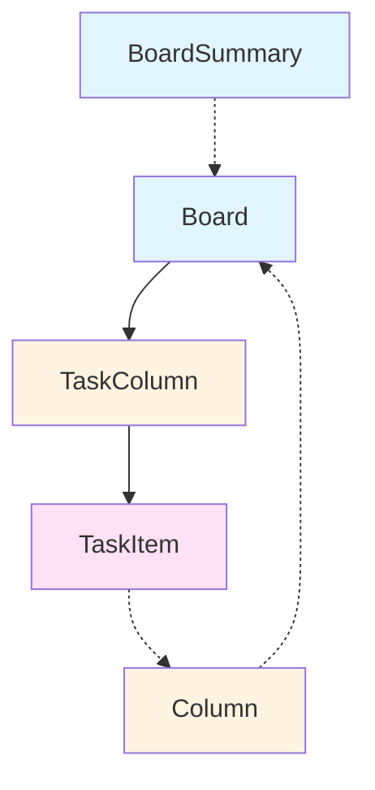

## Overview

TaskFlow uses TypeScript interfaces to ensure type safety throughout the application. This page documents all core interfaces and types used across services, components, and models.

---

## Board Types

### Board

The complete board interface including all columns and tasks.

<ResponseField name="id" type="number" required>
  Unique identifier for the board
</ResponseField>

<ResponseField name="name" type="string" required>
  Display name of the board
</ResponseField>

<ResponseField name="joinCode" type="string" required>
  Unique code for joining the board
</ResponseField>

<ResponseField name="columns" type="TaskColumn[]" required>
  Array of columns contained in the board
</ResponseField>

```typescript
interface Board {
  id: number;
  name: string;
  joinCode: string;
  columns: TaskColumn[];
}
```

**Used in:**
- `BoardService.getBoard()` - Returns full board details
- Board detail page components

---

### BoardSummary

Lightweight board representation without nested data.

<ResponseField name="id" type="number" required>
  Unique identifier for the board
</ResponseField>

<ResponseField name="name" type="string" required>
  Display name of the board
</ResponseField>

<ResponseField name="joinCode" type="string" required>
  Unique code for joining the board
</ResponseField>

```typescript
interface BoardSummary {
  id: number;
  name: string;
  joinCode: string;
}
```

**Used in:**
- `BoardService.getMyBoards()` - Returns list of user's boards
- `BoardService.createBoard()` - Returns newly created board
- `BoardService.updateBoard()` - Returns updated board
- `BoardService.joinBoard()` - Returns joined board
- Board list page components

---

## Column Types

### TaskColumn

Column representation with nested tasks (used within Board).

<ResponseField name="id" type="number" required>
  Unique identifier for the column
</ResponseField>

<ResponseField name="name" type="string" required>
  Display name of the column (e.g., "To Do", "In Progress")
</ResponseField>

<ResponseField name="tasks" type="TaskItem[]" required>
  Array of tasks contained in the column
</ResponseField>

```typescript
interface TaskColumn {
  id: number;
  name: string;
  tasks: TaskItem[];
}
```

**Used in:**
- `Board` interface - Nested column data with tasks
- Board detail page for rendering columns

---

### Column

Standalone column interface with position information.

<ResponseField name="id" type="number" required>
  Unique identifier for the column
</ResponseField>

<ResponseField name="name" type="string" required>
  Display name of the column
</ResponseField>

<ResponseField name="position" type="number" required>
  Order position of the column within the board (0-indexed)
</ResponseField>

<ResponseField name="boardId" type="number" required>
  ID of the parent board
</ResponseField>

```typescript
interface Column {
  id: number;
  name: string;
  position: number;
  boardId: number;
}
```

**Used in:**
- `ColumnService.createColumn()` - Returns newly created column
- `ColumnService.updateColumn()` - Returns updated column
- `ColumnService.moveColumn()` - Returns moved column

---

## Task Types

### TaskItem

Individual task representation with title and description.

<ResponseField name="id" type="number" required>
  Unique identifier for the task
</ResponseField>

<ResponseField name="title" type="string" required>
  Title or name of the task
</ResponseField>

<ResponseField name="description" type="string" required>
  Detailed description of the task
</ResponseField>

```typescript
interface TaskItem {
  id: number;
  title: string;
  description: string;
}
```

**Used in:**
- `TaskColumn.tasks` - Array of tasks within a column
- `TaskService.createTask()` - Returns newly created task
- `TaskService.updateTask()` - Returns updated task
- Task card and task modal components

---

## Authentication Types

### LoginResponse

Response object returned after successful authentication.

<ResponseField name="token" type="string" required>
  JWT authentication token for API requests
</ResponseField>

```typescript
interface LoginResponse {
  token: string;
}
```

**Used in:**
- `AuthService.login()` - Returns authentication token
- Stored in localStorage for subsequent API requests

---

## Request Payload Types

### CreateBoardRequest

Payload for creating a new board.

<ResponseField name="name" type="string" required>
  Name for the new board
</ResponseField>

```typescript
interface CreateBoardRequest {
  name: string;
}
```

**Used in:**
- `BoardService.createBoard()`

---

### UpdateBoardRequest

Payload for updating an existing board.

<ResponseField name="name" type="string" required>
  Updated name for the board
</ResponseField>

```typescript
interface UpdateBoardRequest {
  name: string;
}
```

**Used in:**
- `BoardService.updateBoard()`

---

### JoinBoardRequest

Payload for joining a board using a join code.

<ResponseField name="joinCode" type="string" required>
  Unique join code for the board
</ResponseField>

```typescript
interface JoinBoardRequest {
  joinCode: string;
}
```

**Used in:**
- `BoardService.joinBoard()`

---

### CreateColumnRequest

Payload for creating a new column.

<ResponseField name="boardId" type="number" required>
  ID of the board to create the column in
</ResponseField>

<ResponseField name="name" type="string" required>
  Name for the new column
</ResponseField>

```typescript
interface CreateColumnRequest {
  boardId: number;
  name: string;
}
```

**Used in:**
- `ColumnService.createColumn()`

---

### UpdateColumnRequest

Payload for updating a column's name.

<ResponseField name="name" type="string" required>
  Updated name for the column
</ResponseField>

```typescript
interface UpdateColumnRequest {
  name: string;
}
```

**Used in:**
- `ColumnService.updateColumn()`

---

### MoveColumnRequest

Payload for changing a column's position.

<ResponseField name="newPosition" type="number" required>
  New position index for the column (0-indexed)
</ResponseField>

```typescript
interface MoveColumnRequest {
  newPosition: number;
}
```

**Used in:**
- `ColumnService.moveColumn()`

---

### CreateTaskRequest

Payload for creating a new task.

<ResponseField name="title" type="string" required>
  Title for the new task
</ResponseField>

<ResponseField name="columnId" type="number" required>
  ID of the column to create the task in
</ResponseField>

<ResponseField name="description" type="string">
  Optional description for the task
</ResponseField>

```typescript
interface CreateTaskRequest {
  title: string;
  columnId: number;
  description?: string;
}
```

**Used in:**
- `TaskService.createTask()`

---

### UpdateTaskRequest

Payload for updating a task's content.

<ResponseField name="title" type="string" required>
  Updated title for the task
</ResponseField>

<ResponseField name="description" type="string" required>
  Updated description for the task
</ResponseField>

```typescript
interface UpdateTaskRequest {
  title: string;
  description: string;
}
```

**Used in:**
- `TaskService.updateTask()`
- Task modal save event

---

### MoveTaskRequest

Payload for moving a task to a different column or position.

<ResponseField name="newColumnId" type="number" required>
  ID of the target column
</ResponseField>

<ResponseField name="newPosition" type="number" required>
  New position index within the column (0-indexed)
</ResponseField>

```typescript
interface MoveTaskRequest {
  newColumnId: number;
  newPosition: number;
}
```

**Used in:**
- `TaskService.moveTask()`
- Drag and drop operations

---

### LoginRequest

Payload for user authentication.

<ResponseField name="email" type="string" required>
  User's email address
</ResponseField>

<ResponseField name="password" type="string" required>
  User's password
</ResponseField>

```typescript
interface LoginRequest {
  email: string;
  password: string;
}
```

**Used in:**
- `AuthService.login()`

---

### RegisterRequest

Payload for user registration.

<ResponseField name="username" type="string" required>
  Desired username
</ResponseField>

<ResponseField name="email" type="string" required>
  User's email address
</ResponseField>

<ResponseField name="password" type="string" required>
  User's password
</ResponseField>

```typescript
interface RegisterRequest {
  username: string;
  email: string;
  password: string;
}
```

**Used in:**
- `AuthService.register()`

---

## Component Types

### TaskModalMode

Type definition for task modal operating modes.

```typescript
type TaskModalMode = 'create' | 'edit' | 'view';
```

**Values:**
- `create` - Modal for creating a new task
- `edit` - Modal for editing an existing task
- `view` - Modal for viewing task details (read-only)

**Used in:**
- `TaskModal` component mode input

---

## Type Relationships



### Key Relationships

- **Board** contains an array of **TaskColumn** objects
- **TaskColumn** contains an array of **TaskItem** objects
- **Column** is a standalone representation with position and boardId
- **BoardSummary** is a lightweight version of **Board** without nested data

---

## Best Practices

<Tip>
Use **BoardSummary** for list views and **Board** for detail views to optimize data loading.
</Tip>

<Warning>
Always validate required fields before making API calls to avoid runtime errors.
</Warning>

<Note>
All IDs are numeric values. Ensure proper type conversion when working with route parameters (which are strings).
</Note>

### Type Safety Tips

1. **Use interfaces for service methods**: Always type Observable return values
   ```typescript
   getBoard(id: string): Observable<Board> {
     return this.http.get<Board>(`${this.apiUrl}/${id}`);
   }
   ```

2. **Validate optional fields**: Check for undefined before accessing optional properties
   ```typescript
   const description = task.description || 'No description';
   ```

3. **Type request payloads**: Create explicit interfaces for request bodies
   ```typescript
   createTask(data: CreateTaskRequest): Observable<TaskItem> {
     return this.http.post<TaskItem>(this.apiUrl, data);
   }
   ```

---

## Related Resources

<CardGroup cols={2}>
  <Card title="Board Service" icon="rectangle-vertical-history" href="/api/board-service">
    Learn about board management methods
  </Card>
  
  <Card title="Task Service" icon="list-check" href="/api/task-service">
    Explore task CRUD operations
  </Card>
  
  <Card title="Column Service" icon="columns-3" href="/api/column-service">
    Manage board columns
  </Card>
  
  <Card title="Auth Service" icon="lock" href="/api/auth-service">
    Authentication and authorization
  </Card>
</CardGroup>
