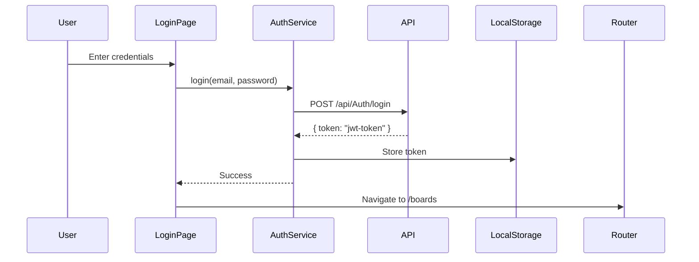
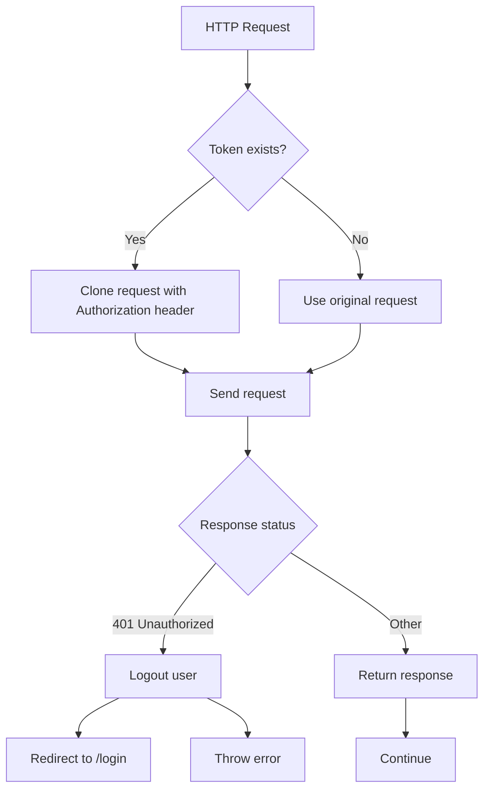

## Overview

TaskFlow Angular implements a robust JWT (JSON Web Token) authentication system that protects routes, automatically attaches tokens to HTTP requests, and handles authentication errors gracefully.

## Authentication Flow

The authentication flow follows this sequence:



## AuthService

The `AuthService` is the central authentication manager that handles login, logout, and token management.

```typescript title="services/auth.service.ts"
import { Injectable, inject } from '@angular/core';
import { HttpClient } from '@angular/common/http';
import { tap } from 'rxjs';

@Injectable({
  providedIn: 'root'
})
export class AuthService {
  private http = inject(HttpClient);
  private apiUrl = 'https://localhost:7057/api/Auth';

  login(email: string, password: string) {
    return this.http.post<{ token: string }>(
      `${this.apiUrl}/login`,
      { email, password }
    ).pipe(
      tap(response => {
        localStorage.setItem('token', response.token);
      })
    );
  }

  logout() {
    localStorage.removeItem('token');
  }

  getToken(): string | null {
    return localStorage.getItem('token');
  }

  isLoggedIn(): boolean {
    return !!localStorage.getItem('token');
  }

  register(data: { username: string; email: string; password: string }) {
    return this.http.post(`${this.apiUrl}/register`, data);
  }
}
```

### Key Methods

<AccordionGroup>
  <Accordion title="login(email, password)">
    Authenticates a user with the backend API and stores the JWT token in localStorage.
    
    ```typescript
    login(email: string, password: string) {
      return this.http.post<{ token: string }>(
        `${this.apiUrl}/login`,
        { email, password }
      ).pipe(
        tap(response => {
          localStorage.setItem('token', response.token);
        })
      );
    }
    ```
    
    The `tap` operator is used to perform a side effect (storing the token) without modifying the stream.
  </Accordion>

  <Accordion title="logout()">
    Removes the JWT token from localStorage, effectively logging out the user.
    
    ```typescript
    logout() {
      localStorage.removeItem('token');
    }
    ```
  </Accordion>

  <Accordion title="getToken()">
    Retrieves the stored JWT token, used by the HTTP interceptor.
    
    ```typescript
    getToken(): string | null {
      return localStorage.getItem('token');
    }
    ```
  </Accordion>

  <Accordion title="isLoggedIn()">
    Checks if a user is authenticated by verifying token existence.
    
    ```typescript
    isLoggedIn(): boolean {
      return !!localStorage.getItem('token');
    }
    ```
    
    <Warning>
    This method only checks if a token exists, not if it's valid. Token validation happens on the server side.
    </Warning>
  </Accordion>
</AccordionGroup>

## Login Page Implementation

The login page demonstrates how to use the AuthService:

```typescript title="pages/auth/login-page/login-page.ts"
import { Component, inject } from '@angular/core';
import { FormsModule } from '@angular/forms';
import { Router, RouterLink } from '@angular/router';
import { AuthService } from '../../../services/auth.service';
import { CommonModule } from '@angular/common';

@Component({
  selector: 'app-login-page',
  imports: [CommonModule, FormsModule, RouterLink],
  templateUrl: './login-page.html',
  styleUrl: './login-page.css',
})
export class LoginPage {
  private authService = inject(AuthService);
  private router = inject(Router);

  email = '';
  password = '';
  error = '';

  login() {
    this.authService.login(this.email, this.password)
      .subscribe({
        next: () => this.router.navigate(['/boards']),
        error: () => this.error = 'Credenciales incorrectas'
      });
  }
}
```

Key features:
- **Error handling** - Displays user-friendly error messages on authentication failure
- **Automatic navigation** - Redirects to `/boards` on successful login
- **Form binding** - Uses Angular's FormsModule for two-way data binding

## Route Protection with AuthGuard

The `authGuard` is a functional guard that protects routes from unauthorized access.

```typescript title="guards/auth-guard.ts"
import { AuthService } from '../services/auth.service';
import { CanActivateFn } from '@angular/router';
import { inject } from '@angular/core';
import { Router } from '@angular/router';

export const authGuard: CanActivateFn = () => {
  const authService = inject(AuthService);
  const router = inject(Router);

  if (authService.isLoggedIn()) {
    return true;
  }

  router.navigate(['/login']);
  return false;
};
```

### How It Works

1. **Check authentication** - Calls `authService.isLoggedIn()` to verify token existence
2. **Allow access** - Returns `true` if authenticated, allowing navigation
3. **Redirect** - Returns `false` and redirects to `/login` if not authenticated

### Usage in Routes

Apply the guard to protected routes:

```typescript title="app.routes.ts"
import { authGuard } from './guards/auth-guard';

export const routes: Routes = [
  // Public routes (no guard)
  {
    path: 'login',
    loadComponent: () => import('./pages/auth/login-page/login-page')
      .then(m => m.LoginPage)
  },
  // Protected routes (with guard)
  {
    path: '',
    component: Layout,
    canActivate: [authGuard],  // Guard applied here
    children: [
      {
        path: 'boards',
        loadComponent: () => import('./pages/boards/board-list-page/board-list-page')
          .then(m => m.BoardListPage)
      },
      {
        path: 'boards/:id',
        loadComponent: () => import('./pages/boards/board-detail-page/board-detail-page')
          .then(m => m.BoardDetailPage)
      }
    ]
  }
];
```

<Note>
The guard is applied to the parent route, protecting all child routes automatically.
</Note>

## HTTP Interceptor

The `authInterceptor` automatically attaches JWT tokens to outgoing HTTP requests and handles authentication errors.

```typescript title="interceptors/auth-interceptor.ts"
import { HttpInterceptorFn } from '@angular/common/http';
import { inject } from '@angular/core';
import { AuthService } from '../services/auth.service';
import { Router } from '@angular/router';
import { catchError } from 'rxjs/operators';
import { throwError } from 'rxjs';

export const authInterceptor: HttpInterceptorFn = (req, next) => {
  const authService = inject(AuthService);
  const router = inject(Router);

  const token = authService.getToken();

  let authReq = req;

  if (token) {
    authReq = req.clone({
      setHeaders: {
        Authorization: `Bearer ${token}`
      }
    });
  }

  return next(authReq).pipe(
    catchError(error => {
      if (error.status === 401) {
        authService.logout();
        router.navigate(['/login']);
      }
      return throwError(() => error);
    })
  );
};
```

### Interceptor Flow



### Key Features

<Steps>
  <Step title="Token Attachment">
    If a token exists, the interceptor clones the request and adds the `Authorization` header:
    
    ```typescript
    authReq = req.clone({
      setHeaders: {
        Authorization: `Bearer ${token}`
      }
    });
    ```
  </Step>

  <Step title="Error Handling">
    If the server returns a 401 Unauthorized error, the interceptor:
    - Logs out the user (removes token)
    - Redirects to the login page
    - Re-throws the error for component handling
    
    ```typescript
    catchError(error => {
      if (error.status === 401) {
        authService.logout();
        router.navigate(['/login']);
      }
      return throwError(() => error);
    })
    ```
  </Step>

  <Step title="Registration">
    The interceptor is registered globally in the application configuration:
    
    ```typescript title="app.config.ts"
    export const appConfig: ApplicationConfig = {
      providers: [
        provideHttpClient(
          withInterceptors([authInterceptor])
        )
      ]
    };
    ```
  </Step>
</Steps>

<Warning>
The interceptor uses the functional interceptor API (`HttpInterceptorFn`), not the class-based `HttpInterceptor` interface. This is the modern Angular approach.
</Warning>

## Complete Authentication Example

Here's a complete example showing authentication in action:

```typescript title="Example: Login Flow"
// 1. User enters credentials in LoginPage
export class LoginPage {
  private authService = inject(AuthService);
  private router = inject(Router);

  email = 'user@example.com';
  password = 'password123';
  error = '';

  login() {
    // 2. Call AuthService.login()
    this.authService.login(this.email, this.password)
      .subscribe({
        next: () => {
          // 3. On success, token is stored in localStorage
          // 4. Navigate to protected route
          this.router.navigate(['/boards']);
        },
        error: () => {
          // 5. On failure, show error message
          this.error = 'Credenciales incorrectas';
        }
      });
  }
}

// 6. When navigating to /boards, authGuard checks authentication
export const authGuard: CanActivateFn = () => {
  const authService = inject(AuthService);
  const router = inject(Router);

  // 7. Check if token exists
  if (authService.isLoggedIn()) {
    return true;  // 8. Allow access
  }

  router.navigate(['/login']);  // 9. Redirect if not authenticated
  return false;
};

// 10. When making API calls, authInterceptor attaches the token
export const authInterceptor: HttpInterceptorFn = (req, next) => {
  const authService = inject(AuthService);
  const token = authService.getToken();  // 11. Retrieve token

  if (token) {
    req = req.clone({
      setHeaders: {
        Authorization: `Bearer ${token}`  // 12. Attach to request
      }
    });
  }

  // 13. If server returns 401, logout and redirect
  return next(req).pipe(
    catchError(error => {
      if (error.status === 401) {
        authService.logout();
        router.navigate(['/login']);
      }
      return throwError(() => error);
    })
  );
};
```

## Security Considerations

<Warning>
**Important Security Notes:**

1. **Token Storage** - Tokens are stored in localStorage, which is vulnerable to XSS attacks. Consider using httpOnly cookies for production.
2. **Token Validation** - The frontend only checks if a token exists, not if it's valid. Always validate tokens on the server.
3. **HTTPS Required** - Always use HTTPS in production to prevent token interception.
4. **Token Expiration** - Implement token refresh mechanisms for better security.
</Warning>

## Best Practices

<CardGroup cols={2}>
  <Card title="Centralize Auth Logic" icon="centralize">
    Keep all authentication logic in the AuthService for consistency.
  </Card>
  <Card title="Handle Errors Gracefully" icon="shield-check">
    Provide clear error messages and handle all authentication failure scenarios.
  </Card>
  <Card title="Protect Sensitive Routes" icon="lock">
    Apply authGuard to all routes that require authentication.
  </Card>
  <Card title="Automatic Token Handling" icon="automation">
    Let the interceptor handle token attachment automatically.
  </Card>
</CardGroup>

## Next Steps

<CardGroup cols={2}>
  <Card title="Architecture" icon="sitemap" href="/core/architecture">
    Learn about the application architecture and folder structure
  </Card>
  <Card title="State Management" icon="database" href="/core/state-management">
    Master signals and reactive state patterns
  </Card>
</CardGroup>